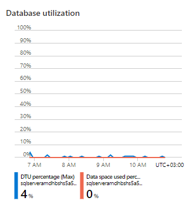
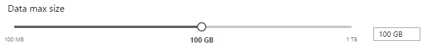
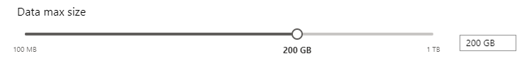

# SQL Server storage size

Go to alerting resource from link:

Select *Compute + storage*:

Check that database is really getting full, in this picture empty test database is shown:

In same page there is slider to increase database size:

Move it one step further right (exact values may differ):

Then press apply:

Scaling might take a moment, however it should be transparent to end users.
