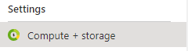
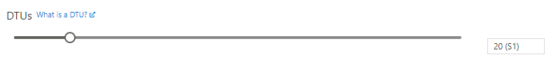

# SQL Server storage size

Go to alerting resource from link:

Select *Compute + storage*:

Move DTU slider (only applicaple if DTU model is used) to right. One step usually means double size compared to previous one.

Then press apply:

Scaling might take a moment, however it should be transparent to end users.
