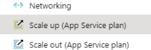

# Fixing web app

Follow resource link from alert (resource is likely different than in image):

## Restarting web app

In resource Overview (from left) at top overview page there is restart button:

Press it and  approve restart.

Wait for 5 minutes to make sure restart is ready. After that validate that is application working.

## Checking service status of web application

Check alerting service health:

And follow tutorial from <https://docs.microsoft.com/en-us/azure/service-health/resource-health-overview>

## Checking Azure service status

Broad scope problems <https://status.azure.com/en-gb/status>, however only issues affecting hole region is visible here.

For more specific status from <https://portal.azure.com/#blade/Microsoft_Azure_Health/AzureHealthBrowseBlade/serviceIssues>

## Changing scale of application / full restart

This enforces full restart of application plan. It is good to know that this will affect all applications running on same plan so only do this if issue is major.

Navigate to Scale Up

There you can see current plan, change it to 1 tier upwards.

After that press 

Scaling will take little while. Wait for 15 minutes and check if issue is fixed.
