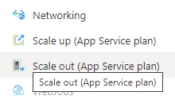
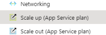

# Scaling web apps

Go to alerting resource from link:

## Checking status

Check target application itself if it really is slow from *application insights* <https://docs.microsoft.com/en-us/azure/azure-monitor/app/tutorial-performance>.

## Scaling apps out

This is preferred method on performance issues since it doesn't cause restart of applications.

Select scale out from left panel

Increase *Instance count* to desired value and press save.

Scaling out takes several minutes, go *application insights* and see if situation is starting to improve.

## Scaling apps up

This enforces full restart of application plan. It is good to know that this will affect all applications running on same plan so only do this if issue is major.

Navigate to Scale Up

There you can see current plan, change it to 1 tier upwards.

After that press

Scaling up takes several minutes, go *application insights* and see if situation is starting to improve.
